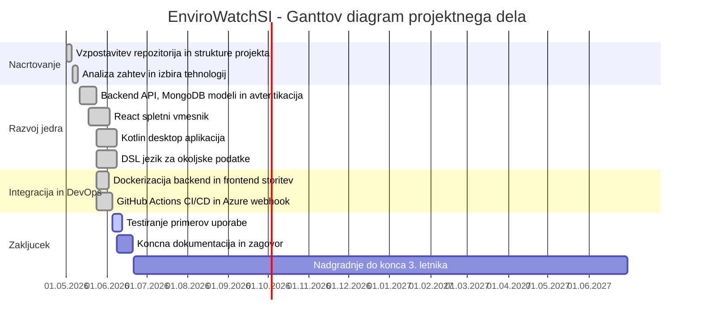
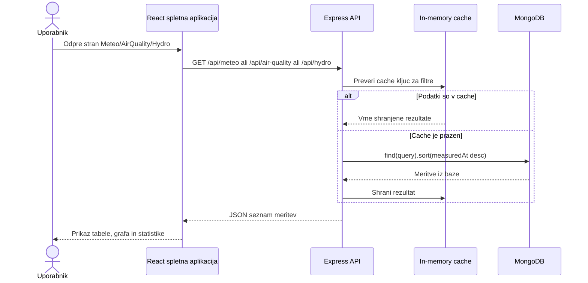
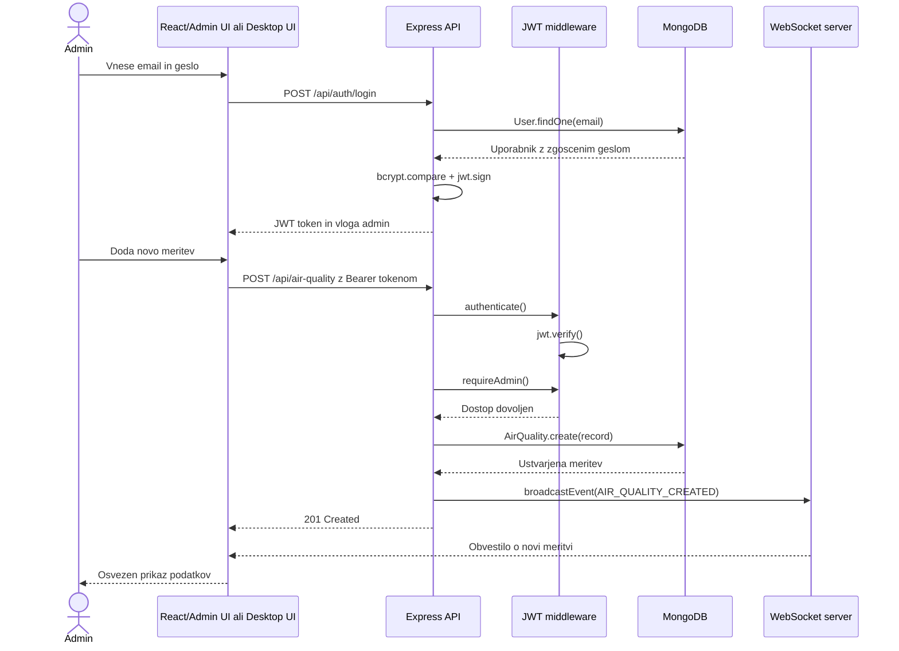
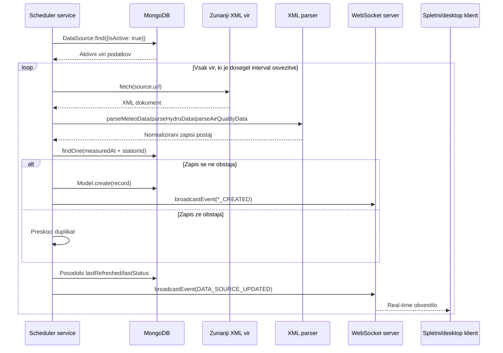
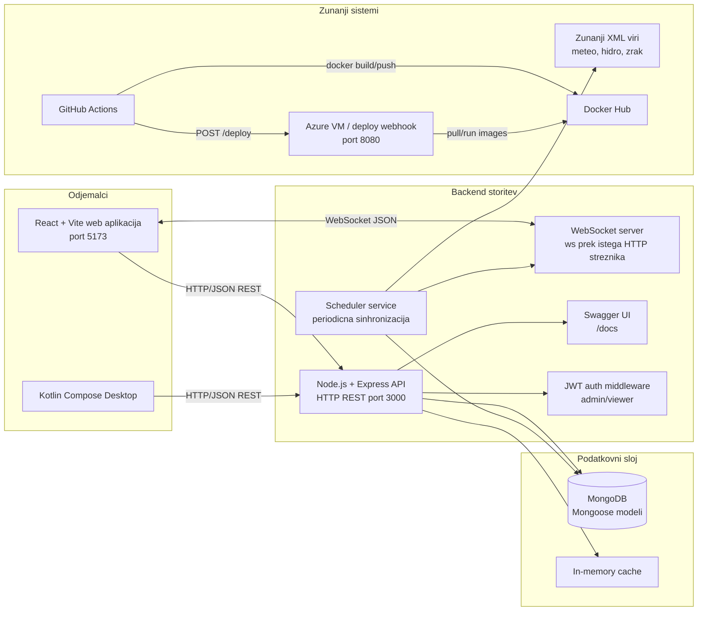
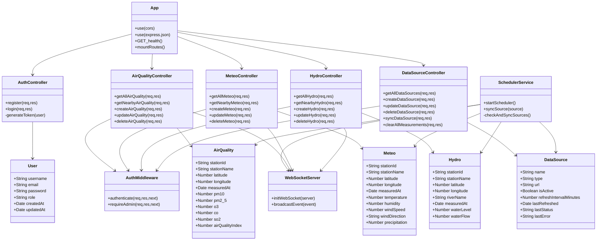
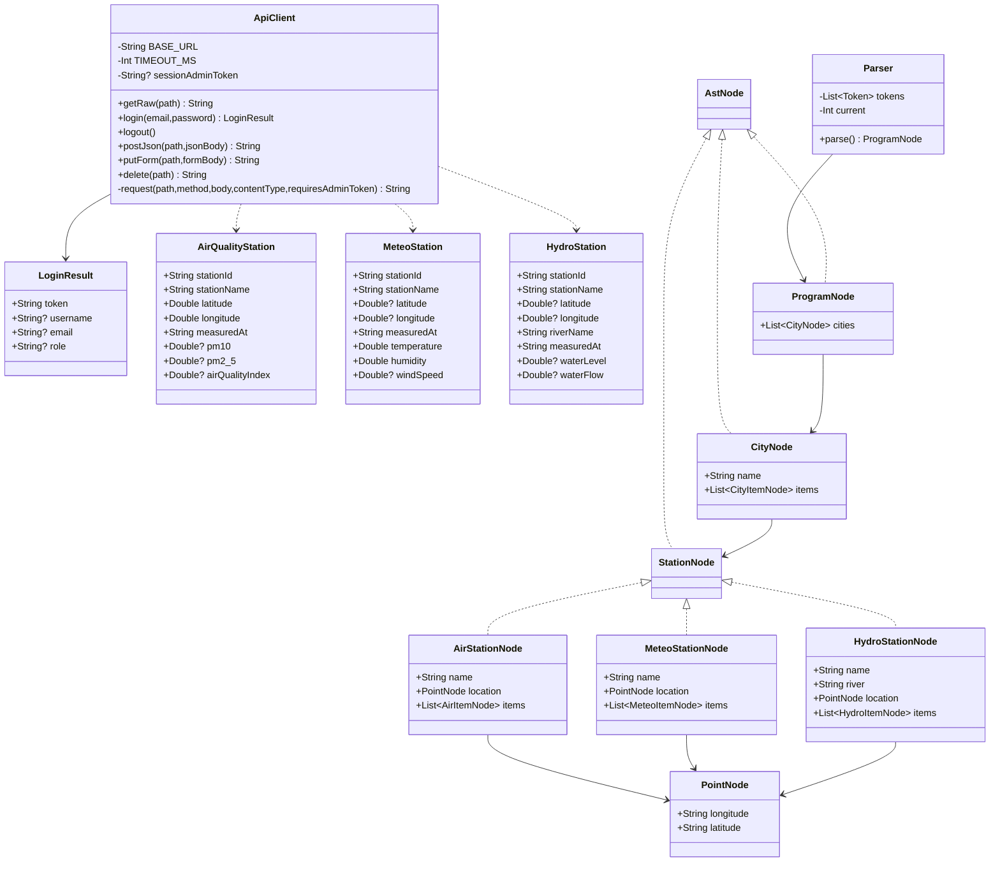
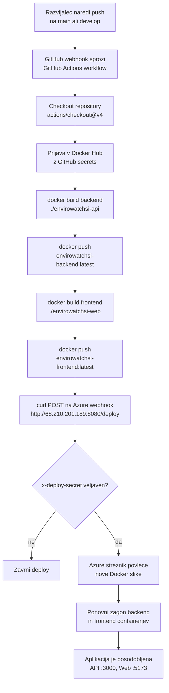
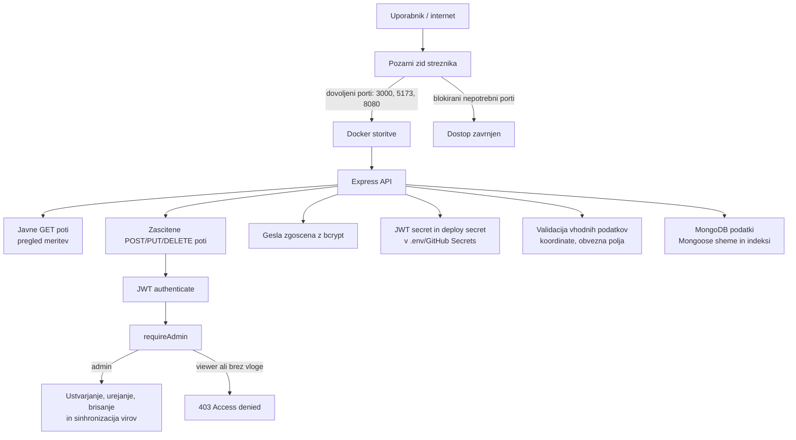

# EnviroWatchSI - Mermaid diagrami za dokumentacijo

Ta datoteka vsebuje pripravljene Mermaid diagrame za koncno dokumentacijo projekta. Imena clanov skupine zamenjajte z dejanskimi imeni.

## Prva stran

## Primer uporabe 1: pregled okoljskih meritev

## Primer uporabe 2: prijava administratorja in dodajanje meritve

## Primer uporabe 3: sinhronizacija zunanjega vira podatkov

## Arhitektura programske resitve

## Razredni diagram: backend JavaScript/Node.js

## Razredni diagram: Kotlin desktop in DSL

## DevOps CI/CD potek

## Varnost programske resitve

## Tehnicni povzetek za besedilo ob diagramih

- Programska jezika: JavaScript za spletni vmesnik in backend, Kotlin za desktop aplikacijo in DSL.
- Podatkovna baza: MongoDB prek Mongoose ODM.
- Spletni streznik: Node.js HTTP server z Express aplikacijo.
- Protokoli: HTTP/REST za API, WebSocket za real-time obvestila, DNS/TCP/IP za povezovanje storitev, HTTP webhook za deploy.
- Vrata: 3000 za backend API, 5173 za frontend, 8080 za deploy webhook.
- Glavne knjiznice: React, Vite, Axios, Leaflet, Recharts, Express, Mongoose, bcryptjs, jsonwebtoken, ws, fast-xml-parser, Swagger UI, Kotlin Compose, Gson.
- DevOps: GitHub Actions, Docker, Docker Hub, Azure deploy webhook.
